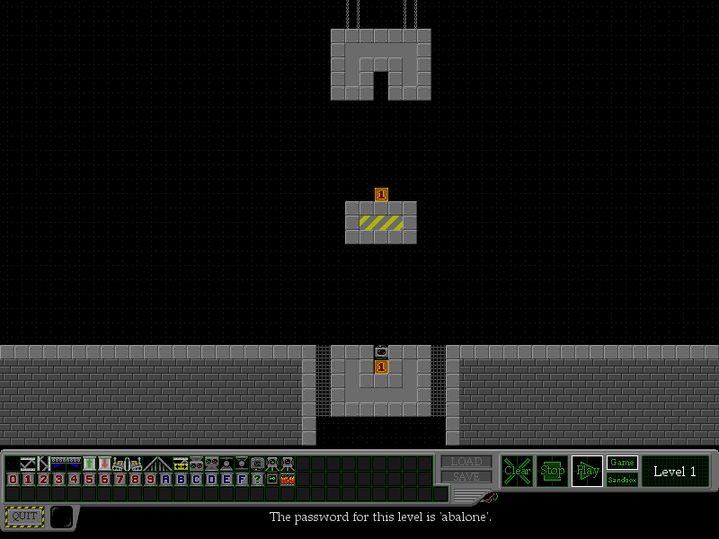

# Rubicon — revival

[Rubicon](https://kevan.org/rubicon/) is a machine-building puzzle game by Kevan Davis
(October 2006, v1.27 from April 2010), built in **Processing 1.x** and shipped as a Java
applet. It's an expanded version of Chris Pressey's ASCII
[RUBE](http://catseye.tc/projects/rube/) language.

This repo does three things:

1. **Runs the original locally** as a desktop Java app — `./run.sh`.
2. **Ports it to JavaScript + canvas** — `web/`, verified bit-identical to the original.
3. **Archives the community levels** before they rot — `warehouse/`.

## Layout

| Path | What |
| --- | --- |
| `web/` | The JS + canvas port |
| `warehouse/` | Mirror of community levels scraped from kevan.org |
| `original/` | Untouched downloads: `rubicon.jar`, `core.jar`, applet host pages |
| `data/` | Assets from `rubicon.jar`: 13 levels, `blocks.gif` spritesheet, fonts |
| `src/rubicon.java` | Decompiled game source (CFR 0.152), 2048 lines |
| `src/tiles.json` | Tile table: id → char → constant → description |
| `tools/` | Level scraper, Java oracle, differential test, frame-capture harness |
| `run.sh` | Launch the original game locally |

## 1. The original, locally

```sh
./run.sh        # java -cp original/rubicon.jar:original/core.jar rubicon
```

No applet container, no browser, no patching: Processing's `PApplet` carries its own
`main()` that opens the sketch in an AWT frame, and all assets load from inside the jar.




Captured with `tools/Launch.java`, which drives the real sketch and dumps its framebuffer —
necessary because live windows aren't screenshottable under Wayland/XWayland.

**Caveats.** `param() only works inside a web browser` at startup is harmless. Saving to the
warehouse is browser-only (`netscape.javascript.JSObject`). And the whole thing has an
expiry date: `PApplet extends java.applet.Applet`, and the Applet API was
[removed in JDK 26](https://openjdk.org/jeps/504) —
[JDK 25 is the last release with it](https://inside.java/2025/12/03/applet-removal/).
That fragility is the argument for the port.

## 2. The JS port

Serve the repo root over HTTP (`python3 -m http.server`) and open `web/index.html`.
Modules, no build step, no dependencies.

| File | Role |
| --- | --- |
| `web/sim.js` | The simulation. Pure, DOM-free, both physics models. |
| `web/tiles.js` | Tile ids, the ASCII alphabet, cargo helpers |
| `web/level.js` | `.rub` parsing, serialisation, palette/lock rules |
| `web/editor.js` | Selection, fill, copy/cut/paste, keyboard component picking |
| `web/rng.js` | Exact `java.util.Random` reimplementation |
| `web/render.js` | HiDPI canvas renderer |
| `web/share.js` | `?level=` encoding, clipboard |
| `web/main.js` | Glue, input, controls |
| `web/selftest.html` | In-browser smoke test |

### High-DPI, from the start

16px tiles at 1:1 are unreadable on a 4K screen. The renderer scales by **integer factors in
device pixels**, and derives the CSS size from the backing store rather than the other way
round:

```
backing store = 800 x 496 source px * integer zoom
CSS size      = backing store / devicePixelRatio
```

That guarantees every source pixel maps to exactly `zoom × zoom` device pixels, so
nearest-neighbour sampling never lands on a fractional boundary. On a 4K display at dpr 2 it
picks zoom 3–6. `devicePixelRatio` changes (moving between monitors, browser zoom) are
picked up via a re-armed `(resolution: Ndppx)` media query — the only reliable signal.

### Editing

Full parity with the original's editor, transliterated from its
`keyPressed`/`mousePressed`/`mouseDragged`:

| Input | Effect |
| --- | --- |
| Left / right click, or drag | Place the selected component / erase |
| **Shift-drag** | Select an area |
| **F** | Fill the selection with the current component |
| **Delete** | Clear the selection |
| **C** / **X** | Copy / cut the selection, then click to place it |
| **Esc** or right click | Drop the selection |
| **0-9**, **A-F**, **?** | Pick cargo by value; the same key again toggles crate ↔ barrel |
| **Arrows** | Walk the palette, skipping unavailable components |
| **S** | Single-step the simulation |
| **P** | Toggle the physics model |

Selection boxes keep the original's representation: `{x, y, w, h}` where `w`/`h` are
*inclusive* spans that go negative mid-drag (dragging up or left) and are normalised by each
operation. The outline reproduces `Box.gameGridRect()`, which draws the right and bottom
edges only when the box isn't clipped by the grid boundary. A pending paste ghosts the
clipboard under the cursor, outlined red for a copy and magenta for a cut.

Editing respects the level's constraints throughout: cells belonging to the locked starting
machine resist fill, erase and paste, and a paste silently drops any tile the level doesn't
make available — so pasting a chunk of one level into a restricted one can't smuggle in
components the puzzle forbids.

Two faithfully preserved quirks: painting is suppressed while any key is held (the
original's `!keyPressed` guard), and arrow-key palette walking is bounded to columns 0-28,
leaving column 29 reachable only by mouse.

### Levels in the URL

kevan.org sends **no `Access-Control-Allow-Origin` header**, so a browser cannot fetch
`rubiload.php` at all. Warehouse codes therefore resolve against our own mirror in
`warehouse/`. Two URL forms:

```
?level=lupebik      7-letter warehouse code -> warehouse/lupebik.rub
?level=eNp1kMFuw...  base64url of zlib-deflated level text (inline, 78-374 chars)
```

They can't be confused — a compressed level never deflates to seven lowercase letters.
Compression uses the platform `CompressionStream`, so there's no library to bundle. "Copy
share link" puts an inline URL on the clipboard; no server, no accounts, nothing to expire.

### Verified against the original

The risk in porting a cellular automaton is subtle rule-ordering divergence: the scan runs
bottom-to-top and mutates in place, so a flipped loop bound looks fine and desyncs 200 ticks
later. So the port isn't eyeballed, it's **diffed against the original Java, tick by tick**.

`tools/Oracle.java` loads a level into the real `rubicon` class and dumps the grid every
tick. It never calls `setup()` — `physics()` only touches field-initialised arrays — so it
needs no graphics, fonts or applet context. `tools/difftest.mjs` runs the same level through
the JS port and compares.

```sh
node tools/difftest.mjs --ticks 200 data/level*.rub          # 12 base levels
node tools/difftest.mjs --ticks 200 warehouse/*.rub          # the archive
node tools/editor_test.mjs                                   # 30 editor unit tests
```

Results: **all 12 base levels and 495+ warehouse levels are bit-identical over 200–300
ticks**, across both physics models, including levels with random cargo.

Random cargo is covered because `web/rng.js` reimplements `java.util.Random` exactly and
both sides are seeded identically. That needs real care: Processing computes
`(int)(60.0f + random(16.0f))` in **float32**, and 60 plus a 20-bit fraction needs 26
mantissa bits — so the addition genuinely rounds. Doing it in float64 yields different
crates. Hence `Math.fround` at each step.

`web/selftest.html` runs the same level in a real browser and hashes the result; that hash
matches the Java oracle exactly.

### Fidelity notes — deliberate, do not "fix"

- `grid()` returns **girder** out of bounds, so the playfield has solid walls.
- The `moved` array is one cell larger than the grid in each direction; rules on the bottom
  row read `moved[x][y+1]` and rely on that slack.
- The `copierup` rule checks `moved[x][y+1]` while writing `moved[x][y-1]`. It looks like a
  typo in the original, but archived levels were designed against it.
- **Both physics models ship.** The November 2006 change made copiers, packers and unpackers
  wait a tick. Levels select the old model via a `* Physics:1` header, and user levels
  *default to v1* — only an explicit `* Physics:2` opts in. Dropping v1 would silently break
  a large share of the archive. The two models differ in exactly three places, so `sim.js`
  branches rather than duplicating 290 lines.
- The tile alphabet is **not a bijection** and decoding uses first-index-wins: `'T'` is
  77/78/79 (target off/green/red) and `'X'` is 28/29/58/59/89. Inverting an id→char map
  instead would load saved targets in the wrong state.

### Still to do

- A level browser over `warehouse/index.json` (metadata is already extracted).
- Touch input; shift-drag and right-click erase are mouse-oriented.
- The original's own dialogs (level password prompts, the old-physics warning).

## 3. The archive

This is the time-sensitive part of the revival. The code isn't going anywhere; the levels
might.

- `kevan.org/rubicon/rubiload.php`, `userlevels/`, `warehouse.php`, forum — **all still up**.
- `stardrifter.org/rubisearch/`, the third-party tool that *indexed* levels by difficulty and
  designer — **dead**, DNS gone. Wayback has snapshots (latest 2023-09-27).

Level codes are seven letters, consonant/vowel alternating (~7.3e8 space), so they can't be
enumerated. Instead `tools/fetch_levels.py` probes candidates mined from the old forum:

```sh
# mine IDs from forum text, then probe them politely (0.35s apart, resumable)
tools/fetch_levels.py tools/candidates.txt warehouse
```

6308 candidates mined from `oldforum.html`; the hit rate on generated-looking IDs is ~97%
(English words like "similar" and "rubicon" match the pattern and simply return `NOT FOUND`).
State lives in `warehouse/_status.tsv`, so the run resumes after an interruption.

Worth doing next: the new SMF forum and the Wayback snapshots of rubisearch almost certainly
contain codes the old forum doesn't.

## Provenance

Original game © Kevan Davis, built with Processing; based on RUBE by Chris Pressey and used
with his permission. v1.27 includes optimisation work by forum user *jnz*. Nothing here is a
redistribution grant — worth asking Kevan before publishing the port or the level mirror,
and he's reachable via the site.
