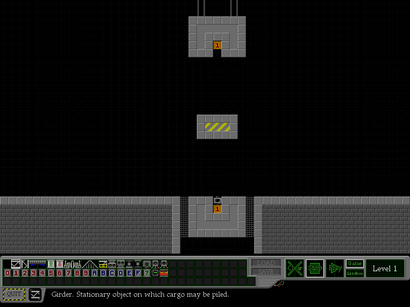

# Rubicon

[Rubicon](https://kevan.org/rubicon/) is a machine-building puzzle game by **Kevan Davis**
(2006–2010, v1.27), written in Processing and shipped as a Java applet. Applets are dead —
the API was [removed in JDK 26](https://openjdk.org/jeps/504) — so this repo keeps the game
playable: a JavaScript port, and a mirror of the community levels.

**▶ Play: https://lynn.github.io/rubicon/** · **Browse the archive:
https://lynn.github.io/rubicon/browse.html**



## What's here

| Path | What |
| --- | --- |
| `index.html`, `web/` | The port: ES modules, canvas, no build step, no dependencies |
| `browse.html` | Browser for the level archive |
| `warehouse/` | 6158 community levels mirrored from kevan.org |
| `original/` | Untouched downloads: `rubicon.jar`, `core.jar`, applet host pages |
| `data/` | Assets from the jar: 13 levels, the spritesheet, the fonts |
| `src/rubicon.java` | Decompiled original (CFR 0.152), for reference |
| `tools/` | Level scraper, Java oracle, differential and UI tests |
| `run.sh` | Run the original applet locally |

## Playing

The port is the original's screen, pixel for pixel: same playfield, same toolbox, same
palette, same buttons. Click to place a component, right-click to erase, Play to run it.

| Input | Effect |
| --- | --- |
| Click / right click | Place / erase |
| **Ctrl-click** | Pick up the component under the cursor |
| **Space** | Run / stop |
| **S** | Single step |
| Shift-drag | Select an area; **F** fill, **Del** clear, **C**/**X** copy/cut then click to place |
| **0-9**, **A-F**, **?** | Pick cargo by value; same key again toggles crate ↔ barrel |
| Arrows | Walk the palette |
| **P** | Switch physics model |

`LOAD` takes a seven-letter level code or a base-level password; `SAVE` puts the whole level
in a share link, so nothing depends on a server.

## Running it yourself

```sh
./run.sh                  # the original, as a desktop Java app (needs JDK 8-25)
python3 -m http.server    # then open http://localhost:8000/ for the port
```

## Tests

```sh
node tools/difftest.mjs --ticks 200 data/level*.rub   # port vs. the real Java, tick by tick
node tools/editor_test.mjs                            # editor unit tests
node tools/ui_probe.mjs                               # drives the UI in headless Chromium
```

`web/selftest.html` runs the module tests in a browser.

## Credits

- **Kevan Davis** — Rubicon itself: design, code, art, levels. Everything in `data/` and
  `original/` is his work, taken from his site.
- **Chris Pressey** — [RUBE](http://catseye.tc/projects/rube/), the ASCII language Rubicon
  expands on, used with his permission.
- **jnz** — optimisation work in v1.27, via the Rubicon forum.
- The level archive is the work of hundreds of forum users, mirrored as they published it.
- Built with [Processing](https://processing.org/) 1.x.

This is a preservation project, not a redistribution grant. Kevan is reachable through
[kevan.org](https://kevan.org/); ask before republishing the game or the level mirror.

Implementation notes — how the port is verified against the original, and which of its
oddities are deliberate — are in [CLAUDE.md](CLAUDE.md).
